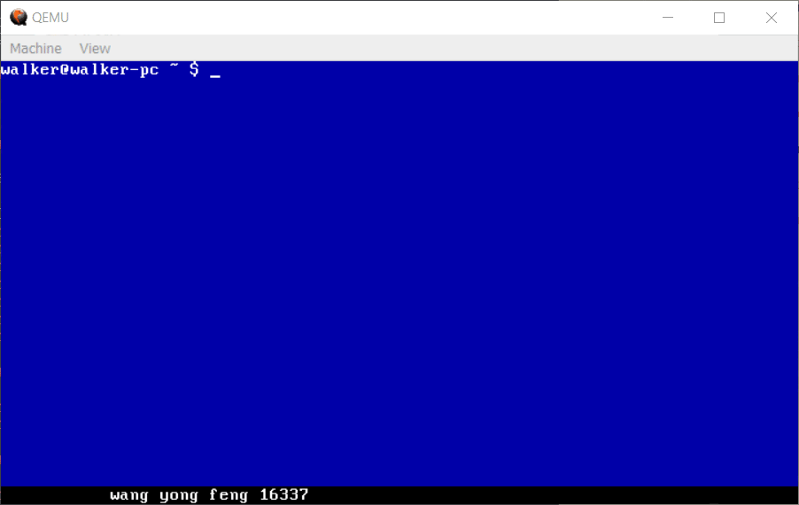

# 操作系统

就把自己在开发操作系统中遇到的各种问题都放上来吧。
放一个开发日志啥的，以方便大家参考。
有一些资料可以供大家参考的也都会放上来。

大概的目标吧，还是想写一个足够完整的操作系统。
至于这个“足够完整”该如何定义，现在也不清楚，尽力吧。

## 录屏效果展示

注：如果看不到的话可能需要翻墙，图床有点不稳定，国内不一定能够访问。

## 实现功能

- [x] 引导扇区加载内核
- [x] FAT16文件系统
- [x] printf系列函数的阉割版实现
- [x] 系统调用表
- [x] 自定义时钟中断（体现为屏幕下方的名字滚动条）
- [x] 简单的命令行终端
    - [x] ls 命令
    - [x] run 命令 运行指定程序
- [ ] 进程
- [ ] 未完待续。。。

## 开发环境

环境：ubuntu for window （win10子系统）

工具链
1. gcc,ld ：c语言必备开发工具
1. make : makefile 解释器
1. nasm：汇编器，能够汇编16位/32位的汇编代码（听说64位也行）
1. dd：将二进制文件写入镜像文件中
1. bximage:(bochs内自带)用于生成二进制文件
1. bochs：虚拟机，调试必备，打开较慢
1. qemu：虚拟机，快速运行查看结果

## 如何运行

1. 先确保在开发环境中的各项工具都可在命令行下直接运行（即在系统环境变量中）
1. 在os文件夹下运行make all，就可以自动编译打开虚拟机。

## 文件组织

1. docs
    1. 放一下在开发过程中遇到的问题，以及需要的各种文档的链接，方便自己也方便大家针对某问题寻找对应的解决方案。
1. dependence
    1. 放一下bochs依赖的几个文件
1. os
    1. 操作系统源代码
1. report
    1. 实验课的实验报告，使用xelatex编译（texlive 2017）。

